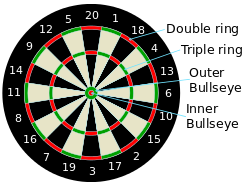

```{r, include = FALSE}
knitr::opts_chunk$set(
  collapse = TRUE,
  comment = "#>"
)
```

## Analysis of 2017 PDC Darts data

A darts match is a race between two players to win a pre-defined number of legs, usually eleven. An individual leg begins with both players on a score of 501 points and they take turns to visit the board and throw three darts. Whatever they score with their three darts is deducted from their score and the first player to reach exactly zero points wins the leg. The only winning condition is that the final dart must land in a double segment or in the bullseye. 

Having the first visit is a significant advantage in a given leg, so before a match begins both players throw a dart at the bullseye and whoever is closest to the centre visits the board first in the first leg. This then alternates each leg for the remainder of the match. In this analysis the player who wins the bull and visits first is classified as the 'home' player and the other is the 'away' player

---



## How to use dartsviz

Step 1: Run function to load raw data to global environment

```{r, eval=FALSE}
load_data_to_global_envir()
```

Step 2: Run functions to transform datasets 

```{r, eval=FALSE}
create_darts_to_complete_leg_dataset()
create_double_success_per_match_dataset()
create_pressure_effect_dataset()
```

Step 3: Launch Shiny app

```{r, eval=FALSE}
launch_app()
```


# Data Dictionary

## Raw Datasets

The following datasets are assigned to the global environment when the function `load_data_to_global_envir()` is executed:

### throws

A tibble containing 254,108 rows and 9 variables describing an individial dart that is thrown

* **throw_id** - integer - unique identifier for the throw
* **player_id** - integer - unique identifier for the player
* **leg_id** - integer - unique identifier for the leg
* **is_home** - boolean - TRUE if the player throwing the dart is the home player
* **segment** - integer - scoring value of the segment that was hit
  + 0 = missed the board
  + 1-20 = corresponding wedge-shaped segment
  + 25 = outer bullseye
  + 50 = bullseye
* **ring_id** - integer - multiplier applied to segment to account for double and triple scores
  + 0 = misses and busts
  + 1 = single (black or white) segments
  + 2 = double ring
  + 3 = triple ring
* **dart_sequence** - integer - 1, 2 or 3 representing the first, second or third throw of the players turn
* **visit_sequence** - integer - which visit was the throw a part of? In each leg this will go 1,1,1..2,2,2...3,3,3 etc.
* **score_before** - integer - the players score before the throw


### legs

A tibble containing 7,330 rows and 6 variables describing a single leg

* **leg_id**
* **match_id**
* **home_score** - integer - number of legs won by the home player in that match on completion of the given leg
* **away_score** - integer - number of legs won by the away player in the match on completion of the given leg
* **home_winner** - boolean - TRUE if home player won the leg
* **winner_id** - integer - unique identifier of the playing who won the leg

### completed_matches

A tibble containing 684 rows and 7 variables describing a completed match

* **match_id**
* **home_player_id**
* **away_player_id**
* **home_score** - integer - final score for the home player
* **away_score** - integer - final score for the away player
* **winner_home** - boolean - TRUE if home player won the match
* **winner_id** 

### players

A tibble of 100 rows and 2 variables describing an individual player

* **player_id** 
* **name** string - the name of the player

## Transformed Datasets

### darts_to_win_leg_dataset

Assigned to global environment when `create_darts_to_complete_leg_dataset()` is run

A tibble containing 7,173 rows and 3 variables describing a leg, which player won it and how many darts it took them to do so

* **leg_id** 
* **name** - string - the name of the winning player
* **darts_thrown** - integer - the number of throws by the winner of each leg_id

### double_conversion_dataset

Assigned to global environment when `create_double_success_per_match_dataset()` is run

A tibble containing 1,364 rows and 3 variables describing the conversion rate of each player in each match

* **match_id**
* **name** 
* **conversion** - double - percentage conversion of throws that were leg winning opportunities

### pressure_effect_dataset

Assigned to global environment when `create_pressure_effect_dataset()` is run

A tibble containing 174 rows and 3 variables. For each player that had 50 conversion opportunities, describes their conversion rate when they are and are not 'under pressure' ie. their opponent had 60 or fewer points remaining

* **name**
* **is_pressure** - boolean - TRUE when the conversion rate
* **conversion** - double - percentage conversion of throws that were leg winning opportunities 

